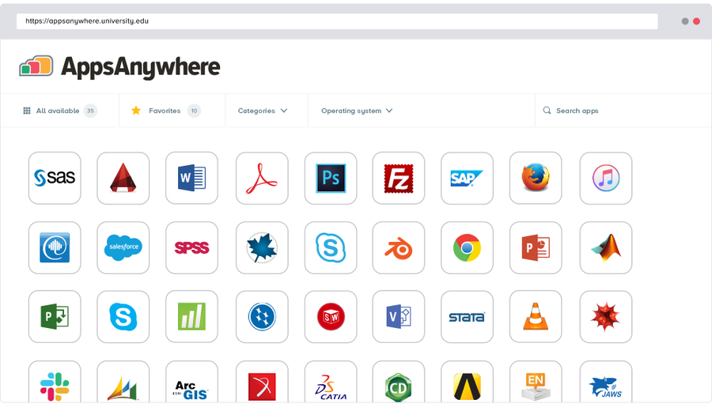
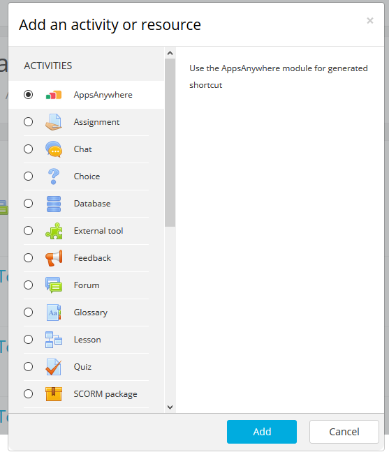
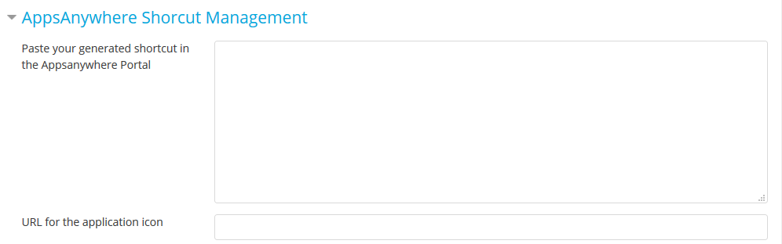
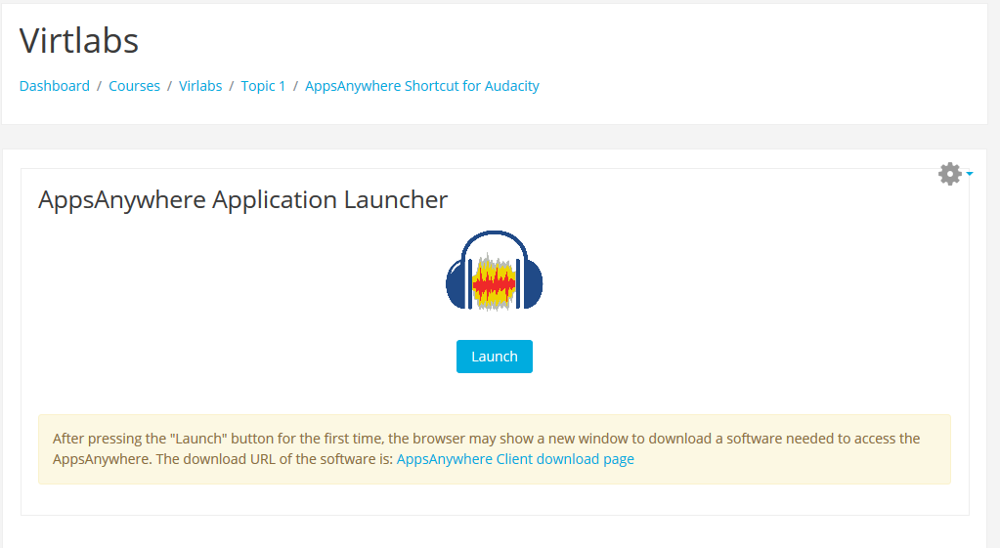
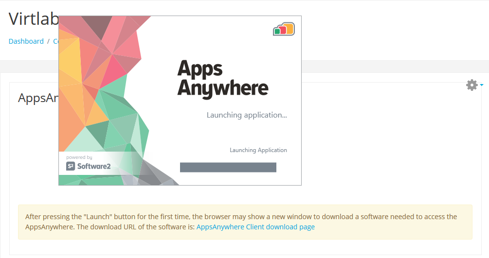

**AppsAnywhere for Moodle** (http://moodle.org/)

The Consorci de Serveis Universitaris de Catalunya (CSUC) has integrated AppsAnywhere (http://www.software2.com/appsanywhere) using the Moodle plugin mod_appsanywhere. Differents Applications are now available to students from Moodle subjects with easy management.

AppsAnywhere is an app store-style platform that gives students access to all the software they need. It provides Higher Ed IT a way to virtualize and deliver all your software from one place to any device, including Windows, Mac and Chromebooks, while meeting key strategic IT initiatives such as Bring Your Own Device (BYOD).

This program is free software; you can redistribute it and/or modify it under the terms of the GNU General Public License as published by the Free Software Foundation; either version 3 of the License, or (at your option) any later version.

This program is distributed in the hope that it will be useful, but WITHOUT ANY WARRANTY; without even the implied warranty of MERCHANTABILITY or FITNESS FOR A PARTICULAR PURPOSE. See the GNU General Public License for more details: http://www.gnu.org/copyleft/gpl.html

**Screenshots**

Created by:

Miguel Ángel Flores - (miguel.angel.flores@csuc.cat)

